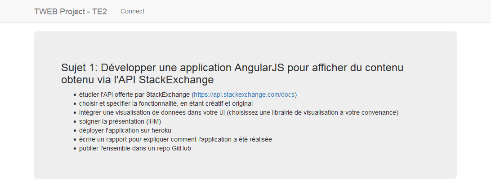
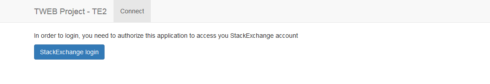
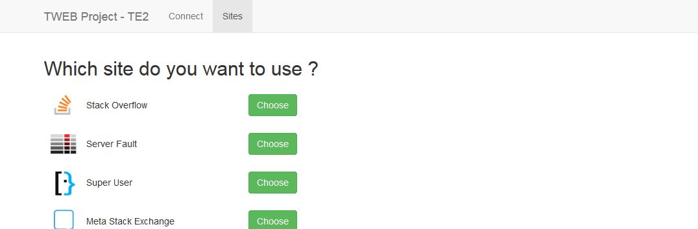
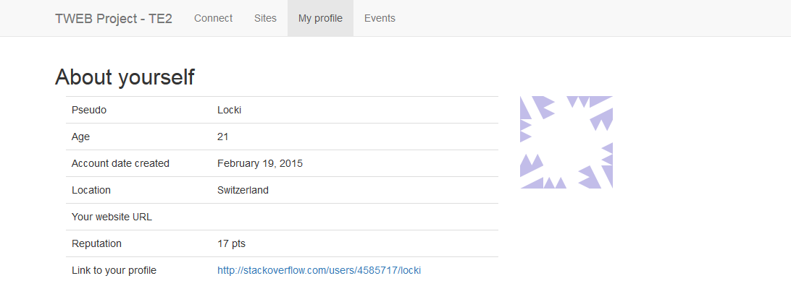

# TWEB Project TE2

Ce repository contient le code concernant le TE2 de TWEB.

L'URL du site hébergé sur Heroku est la suivante : [https://protected-brushlands-95897.herokuapp.com/](https://protected-brushlands-95897.herokuapp.com/)

## Choix de l'API utilisée

J'ai personnellement choisi de me porter sur l'API de StackExchange ([https://api.stackexchange.com/docs](https://api.stackexchange.com/docs)).

## Concernant l'application

### Technologies utilisées

Parmi les technologies employées, on peut citer:

- *AngularJS*, *AngularUI Router*, *Angular Chart* et *Bootstrap* pour le client
- *Express* et *Jade* pour le serveur

### Fonctionnement de l'application

Au lancement de l'application, l'utilisateur arrive sur la page de bienvenue :

Il dispose d'une barre de menu en haut de l'application avec une seule options `Connect` qui lui amène sur la deuxième vue :

Cette page lui permet, après avoir cliqué sur le bouton `StackExchange login`, d'autoriser l'application à connaitre l'impact du compte utilisateur sur le réseau de StackExchange.

D'une fois qu'il a autorisé l'application, il est redirigé sur la vue qui propose la liste des sites accessible depuis l'API de StackExchange. Il est à noter qu'un nouvel onglet est apparu dans le menu, `Sites`, qui permet d'afficher cette vue.

Après avoir choisi le site à utiliser, l'utilisateur est redirigé sur la vue affichant son profil. Il est à noter que deux nouveaux onglets font leur apparition, `My profile` ainsi que `Events`. Le premier sur lequel l'utilisateur est automatiquement redirigé, lui affiche les informations de son profil sur le réseau sélectionné.

Enfin, la dernière vue, `Events`, permet d'afficher des graphiques contenant les informations prise depuis StackExchange et concernant le site choisi précédemment.

Concernant cette dernière partie, auncun graphique n'est affiché et cette page est, en l'état, inutile. En effet, je n'ai pas réussi à afficher un graphique, même avec les données de base présent sur le site d'Angular Chart.

### Endpoints de StackExchange utilisés

Les endpoints suivants ont été utilisés :

- */oauth/dialog* => permettant de se connecter et d'autoriser l'application
- */2.2/sites* => permettant d'obtenir la liste des sites disponibles
- */2.2/me* => permettant d'obtenir les informations sur l'utilisateur
- */2.2/events* => permettant d'obtenir la liste des events

## Déploiement sur Heroku

Après avoir déployer l'application sur Heroku, je n'ai pas la feuille de style de Boostrap qui est chargée. Dans la console de développement, j'ai l'erreur suivante qui m'est affichée :
> La feuille de style https://protected-brushlands-95897.herokuapp.com/components/bootstrap/dist/css/bootstrap.min.css n'a pas été chargée car son type MIME, « text/html », n'est pas « text/css ».

N'ayant jamais vu cette erreur et ayant rapidement cherché des informations sur Google, je ne suis tombé que sur des forums datant de 2005, 2007. Ce qui est très vieux et qui ne m'a pas permis de résoudre le problème.

En local je n'avais aucun problèmes, c'est seulement après l'avoir déployé sur Heroku que le problème est survenu.
